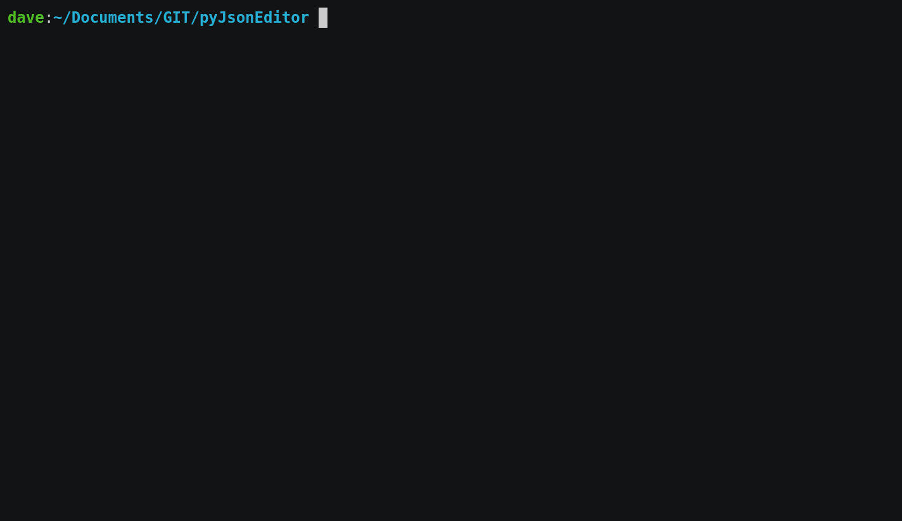

# pyJsonEdit

Edit parts of inconsistently formatted json

## how to install

> pip install --upgrade pyjsonedit

# json in python

pure pyhon implementation of json encoder/decoder
# matcher

now you can select nodes in json tree

## example: mask selected nodes

Add this  / ! 

